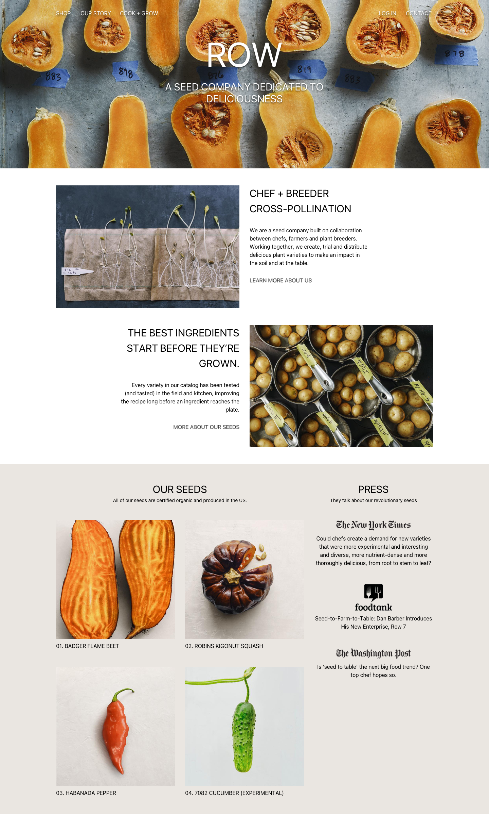

# Exercice Bootstrap 5 - Maquette responsive avancé

Intégrez la maquettes en utilisant la grille Bootstrap.

**Commencez par intégrer uniquement la grille**, puis ajoutez le contenu par la suite.

### Trouver la maquette

Le fichier se trouve:

- dans l'équipe de votre classe
- dans le projet _FD-03-Bootstrap_

Il se nomme _05 - Bootstrap - Maquette responsive avancé_.

Vous pouvez également le trouver [ici](https://www.figma.com/file/GDi0lE2baU3xNVOIuak8Uy/05---Bootstrap---Maquette-responsive-avanc%C3%A9?type=design&mode=design&t=pacHzU1MGNhbAjNW-1).

```CSS
.row + .row {
  margin-top: 16px;
}

.row > .col,
.row > [class^=col-] {
  padding-top: 12px;
  padding-bottom: 12px;
  background-color: rgba(86, 61, 124, .15);
  border: 1px solid rgba(86, 61, 124, .2);
}
```


